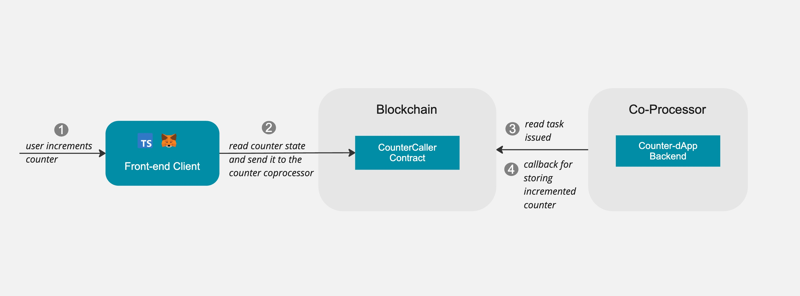

# Simple Counter Template[JS/TS] - Cartesi Coprocessor 

This is an end-to-end template that demonstrates a simple counter running on Cartesi co-processor's infrastructure.

## How does it work?
A user can connect their wallet to the frontend and increment the counter. The frontend will send a transaction to the caller contract, which will then call the co-processor to increment the counter. The co-processor will then return the result to the on-chain contract, which will be reflected on the UI.

A data flow diagram is provided below to help you understand the flow of data between the frontend, the on-chain contract, and the co-processor.



## Project Structure

- `backend-cartesi-counter/` - Counter dApp backend implementation in JavaScript.
- `contracts/` - Smart contract with custom dApp logic and function to issue task to the co-processor.
- `ui-coprocessor-template/` - Frontend React application for reading the counter value and incrementing it.

## Setup Instructions

### 1. Run Cartesi-Coprocessor devnet environment

Clone and navigate to the repository:
```shell
git clone https://github.com/zippiehq/cartesi-coprocessor && cd cartesi-coprocessor
```

Initialize all submodules:
```shell
git submodule update --init --recursive
```

Start the devnet environment in detached mode:
```shell
docker compose -f docker-compose-devnet.yaml up --wait -d
```

To turn down the environment, run:
```shell
docker compose -f docker-compose-devnet.yaml down -v
```


### 2. Build and Deploy Backend Cartesi Machine

Navigate to the backend folder and follow steps in the backend [README](./backend-cartesi-counter/README.md).

### 3. Deploy CounterCaller Smart Contract


To deploy the contract, cd into the `contracts` folder and run the following command:

```shell
$ forge create --broadcast \
    --rpc-url <your_rpc_url> \
    --private-key <your_private_key> \
    ./src/CounterCaller.sol:CounterCaller \
    --constructor-args <coprocessor_address> <machine_hash>
```

Example values for local development:
- RPC URL: http://127.0.0.1:8545
- Coprocessor Address: It's the `task_issuer` that you can get from [config-devnet.toml](https://github.com/zippiehq/cartesi-coprocessor/blob/dbcc51edb7c8edf0ff1d385ed3f36c5f73230ec5/config-devnet.toml#L8)
- Machine Hash: Get from cartesi-backend deployment output

NOTE: Copy the deployed contract address you get from above command and save it for later use in the frontend interaction.

### 4. Run Frontend Application

Navigate to the frontend folder and follow steps in the [README](./ui-coprocessor-template/README.md)

The frontend will be available at http://localhost:3000


## Usage

1. Connect your wallet to the local network (chain ID: 31337)
2. Use the UI to increment the counter
3. Transactions will be processed by the Cartesi machine and results reflected in the UI

## License

MIT

